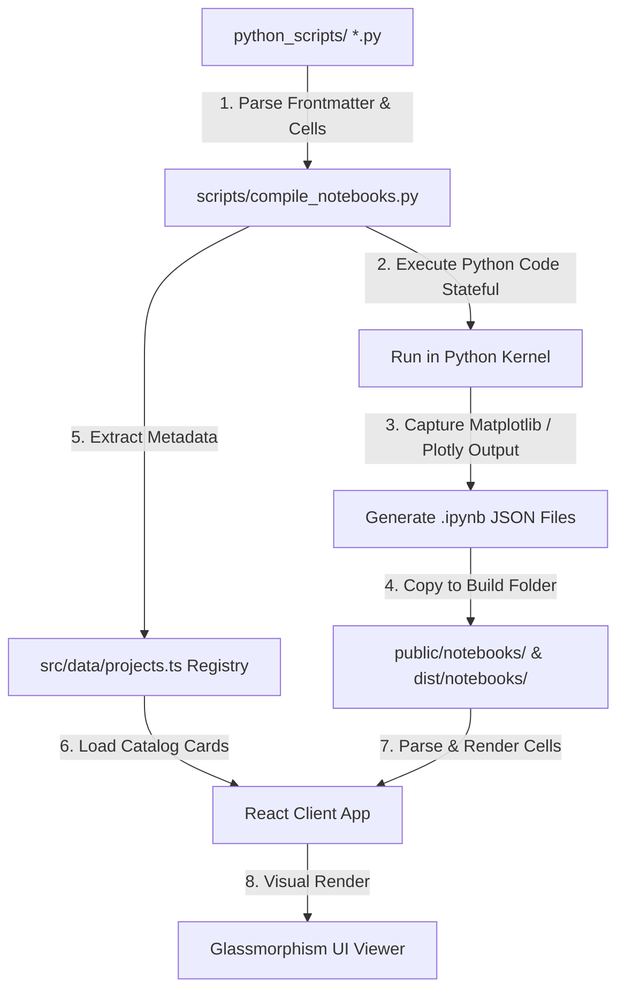
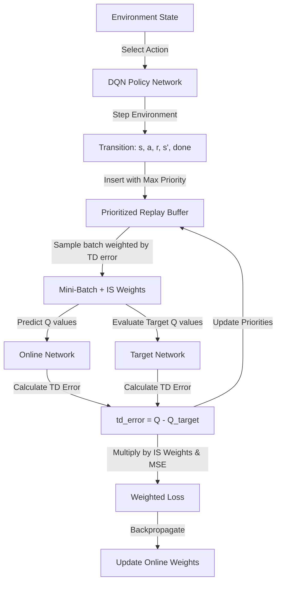
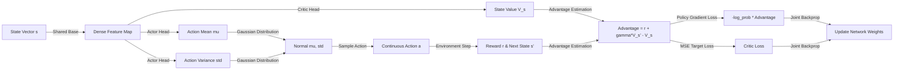
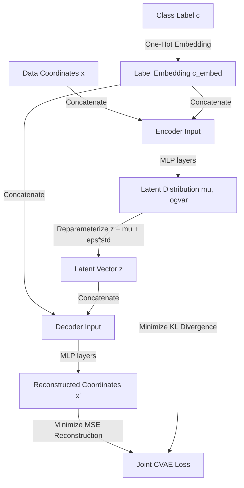

# Shivansh Kandwal | AI & Data Science Portfolio Sandbox

An interactive, high-fidelity computational sandbox displaying Exploratory Data Analysis (EDA), Machine Learning (ML), and Deep Learning/AI projects. This repository integrates live Jupyter Notebook parsing, D3 interactive simulations, GPU training telemetry dashboards, and a stateful compiler to catalog and run computational experiments.

---

## 🗺️ System Architecture & Compilation Pipeline

The portfolio website parses and displays Jupyter Notebooks on-the-fly. To streamline development, we use a custom compiler that processes raw Python scripts (`# %%` cell format) containing YAML frontmatter, executes them statefully, generates executed `.ipynb` outputs, and updates the frontend registry dynamically.



---

## 📚 Core Topics & Algorithms Covered (100 Projects)

This sandbox contains exactly **100 computational projects** divided into three categories:

### 1. Exploratory Data Analysis & Visualizations (EDA)
- **Statistical Distributions & Densities**: Seaborn violin plots, Matplotlib hexbin densities, student score distributions, and polar radar server traffic loops.
- **Geospatial & Flow Visuals**: 3D earthquakes Scattergeo globes, US property valuation choropleths, product purchase Sankey loops, and co-purchase chord diagrams.
- **Text Analytics**: Frequency word clouds distributed along logarithmic spirals, TF-IDF document similarity maps.

### 2. Classical & Semi-Supervised Machine Learning (ML)
- **Dimensionality Reduction**: t-SNE high-dimensional projections, PCA components pipelines.
- **Clustering Algorithms**: DBSCAN density clustering, Gaussian Mixture Models (GMM) with covariance ellipses, hierarchical Ward linkage dendrograms, Spectral clustering, and Silhouette widths.
- **Advanced Regressions**: Partial Least Squares (PLS), Principal Component Regression (PCR), Ridge (L2) vs. Lasso (L1) coefficient paths, ElasticNet mixing weights, and ARIMA seasonal forecasts.
- **Semi-Supervised Learning**: Label Propagation spreading annotations across similarity graphs.

### 3. Deep Learning & Cognitive AI (AI)
- **Sequence Models**: PyTorch LSTMs, sequence-to-sequence autoencoders, GRU sensor forecasters, and RNN binary signal classifiers.
- **Generative AI**: Conditional VAEs (CVAE) synthesizing targeted geometries, GANs generating coordinate distributions, and Neural Style Transfer edge-filter optimizer loops.
- **Transformers**: Multi-head self-attention encoder sequence classifiers in PyTorch.
- **Reinforcement Learning**: Tabular Q-learning, Deep Q-Networks (DQN) with Prioritized Experience Replay (PER), Double DQN, Dueling DQN, Continuous control Gaussian Actor-Critic (A2C), and Gridworld navigation.

---

## 📊 Technical Flowcharts of Key Implementations

### A. Deep Q-Network (DQN) with Prioritized Experience Replay (PER)
This flowchart shows how transitions are sampled proportionally to their absolute TD errors and how importance sampling weights stabilize gradient updates.



### B. Gaussian Actor-Critic (A2C) Continuous Control
Continuous actions are modeled as Gaussian distributions. The actor optimizes policy mean ($\mu$) and variance ($\sigma$) parameters, while the critic reduces state-value estimation errors.



### C. Conditional Variational Autoencoder (CVAE)
To enable targeted generation, both the Encoder and Decoder networks are conditioned by embedding labels alongside feature inputs.



---

## 📂 Project Structure

```text
DataScienceDev/
├── python_scripts/             # Raw Python scripts (.py template files)
│   ├── tsne_projection.py      # Manifold cluster mapping
│   ├── conditional_vae.py      # PyTorch generative conditional autoencoder
│   └── cnn_1d_ecg.py           # 1D CNN cardiac sequence classifier
├── scripts/
│   └── compile_notebooks.py    # Stateful compiler converting .py scripts to .ipynb
├── public/
│   └── notebooks/              # Executed notebook JSON outputs (.ipynb files)
├── src/
│   ├── components/             # React visualizers and simulators
│   │   ├── D3Network.tsx       # Draggable pulsing neural network
│   │   ├── GradientDescent.tsx # Convex optimization simulator
│   │   ├── NotebookViewer.tsx  # Notebook cell renderer
│   │   └── TelemetryDashboard.tsx # GPU epoch training simulator
│   ├── data/
│   │   └── projects.ts         # Dynamically generated projects registry index
│   ├── App.tsx                 # Main layout routing and tab navigation
│   └── index.css               # Design system token definitions
└── package.json                # npm scripts & dependency packages
```

---

## 🛠️ Getting Started

To run the client server and execute Python scripts locally:

### Prerequisites
Make sure you have **Node.js (v18+)** and **Python (v3.10+)** installed on your system.

### 1. Install Dependencies

**Node.js Packages:**
```bash
npm install
```

**Python Libraries:**
```bash
pip install matplotlib seaborn plotly xgboost pandas scikit-learn pyyaml torch statsmodels
```

### 2. Compile Python Scripts
Compile your python scripts to execute them and regenerate the projects list dynamically:
```bash
python scripts/compile_notebooks.py
```

### 3. Run Development Server
```bash
npm run dev
```
Open [http://localhost:5173](http://localhost:5173) in your browser.

---

## 📝 Adding New Projects

Adding a new project to the catalog is fully automated:

1. Create a new `.py` script inside the `python_scripts/` directory (e.g., `python_scripts/my_experiment.py`).
2. Add a YAML metadata block at the top specifying details:
   ```python
   # ---
   # title: "Custom MLP Classifier"
   # description: "Supervised classification using batch normalization in PyTorch."
   # category: "AI"                         # Must be "EDA", "ML", or "AI"
   # tags: ["PyTorch", "MLP", "Classifier"]
   # date: "2026-07-08"
   # metrics:
   #   Accuracy: "94.5%"
   #   Loss (BCE): "0.145"
   # ---
   ```
3. Separate cells using `# %%` (for python code) and `# %% [markdown]` (for markdown description cells).
4. Run `python scripts/compile_notebooks.py` to compile the script and automatically rebuild the frontend projects registry cards list!
